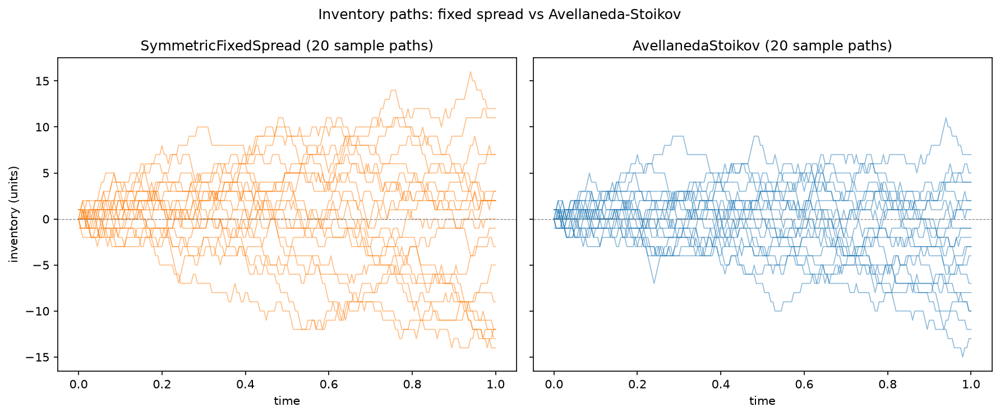
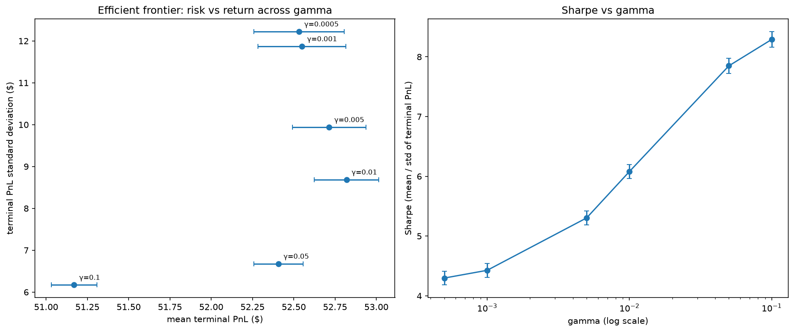
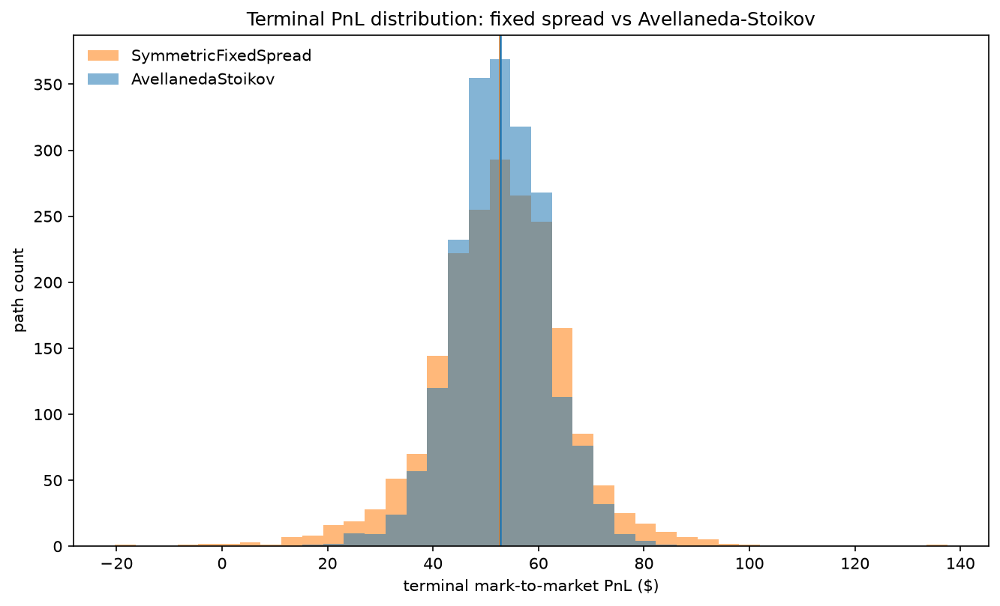
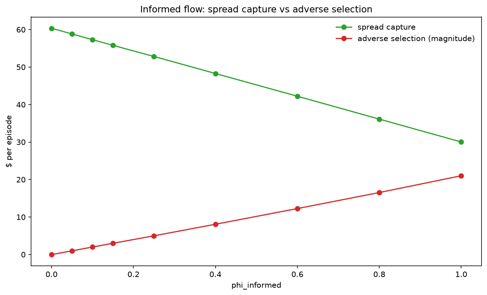

# Market Making Simulator

## 1. Summary

This implements the Avellaneda-Stoikov (AS) market making policy in a simulated limit order
market, to find out what inventory-aware quoting actually buys you. Compared against a
fixed-spread baseline calibrated to quote at the same average width (1.3590), AS cut terminal
PnL standard deviation by 31.03%, from 12.60 to 8.69, with mean PnL that is not
statistically distinguishable from the baseline. The comparison is paired: both strategies
replay the same 2000 price paths and the same fill draws, so the per-path difference is the
right test. That difference is +0.2052 in AS's favour with a standard error of 0.1503, so
t = 1.36, which is not significant. Same money, much less variance in how you get there,
which is what a risk-control policy is supposed to do.

## 2. The problem

A market maker quotes a bid and an ask around a mid-price and earns the spread from
counterparties trading for reasons unrelated to short-term price direction. That part is a
fee business and in expectation it makes money. The trouble is that fills arrive
stochastically and often one-sided. A run of buyers leaves you short, a run of sellers leaves
you long. Inventory piles up as a by-product of doing business, and once you are holding a
position your PnL depends on where the price goes. The market-neutral fee earner has quietly
become a directional bet you never chose to take.

The second problem is that some counterparties know something. They trade precisely because
they expect the next move, which means you systematically buy just before the price falls and
sell just before it rises. That is adverse selection, and it comes straight out of the spread
revenue. So a market maker's economics are really the gap between two numbers: spread
captured from uninformed flow, and value handed to informed flow. This project measures those
two separately instead of only reporting the total.

## 3. Model

The mid-price is driftless arithmetic Brownian motion, `S_{t+dt} = S_t + σ·√dt·Z`. Arithmetic
rather than geometric, because that is the convention the AS closed form is derived under.

**Reservation price**, the centre you quote around:

```
r_t = S_t - q_t · γ · σ² · (T - t)
```

The centre sits below the mid when you are long and above it when you are short. The shift
grows with inventory `q`, risk aversion `γ`, volatility `σ`, and time remaining `(T - t)`. At
`t → T` it disappears, since there is no time left for inventory to hurt you. This is the
skew, and it is not a heuristic bolted on afterwards. It falls out of the control solution.

**Optimal total spread**, how wide to quote:

```
spread_total = γ·σ²·(T - t)  +  (2/γ)·ln(1 + γ/κ)
```

The first term is the inventory risk term: widen when volatility is high and the session is
long, because there is more time for inventory to move against you. The second is the
microstructure term, which depends only on `κ`, the rate at which fill probability decays with
distance from the mid. Quotes go symmetrically around `r_t`, which makes them asymmetric
around the mid, and that asymmetry is the whole mechanism.

## 4. Simulator

Arrivals are Poisson with intensity decaying exponentially in distance from the mid,
`λ(δ) = A·exp(-κ·δ)`, drawn independently on each side each step. Distances are measured from
the mid, not from the reservation price. A counterparty decides whether your quote is good
relative to the actual market; they have no idea where your inventory sits.

Informed flow is explicit. With probability `phi_informed` an arrival is informed, and an
informed arrival only executes if it is on the side that turns out to be right over the next
`informed_horizon` steps. That requires looking ahead at the pre-generated path, and the
lookahead is confined entirely to the counterparty model. The strategy only ever sees `t`,
`S_t`, `q_t` and its own fill history, and there is a test asserting that no future prices are
reachable from it.

PnL decomposes exactly:

```
PnL_total = Σ_fills (mid_at_fill - execution_price)·signed_size   (A) spread capture
          + Σ_steps  q_i·(S_{i+1} - S_i)                          (B) inventory PnL
```

This identity is checked to within 1e-9 on every path of every configuration, as a hard
assert that runs before any number gets written. Term (B) splits further into adverse
selection (signed size times the mid move over the attribution horizon) plus a residual, which
is reported rather than hidden. At the frozen defaults that residual is +0.0162 against 55.79
of spread capture, so the attribution horizon is not mis-set.

What is not realistic is in section 6. The big one is that quotes are recentred on the mid
every single step, with no latency and no queue.

## 5. Results

Everything below uses 2000 Monte Carlo paths per configuration, with the same base seed across
every parameter value so comparisons are paired rather than polluted by seed noise. Sharpe
here means mean terminal PnL divided by the standard deviation of terminal PnL across paths,
not annualised, since each path is one independent session rather than a point on a time
series.

### Headline comparison (`results/tables/headline_comparison.csv`)

| strategy | mean PnL | SE | PnL std | Sharpe | spread capture | adverse selection | mean \|q\| | max \|q\| | fills |
|---|---|---|---|---|---|---|---|---|---|
| SymmetricFixedSpread | 52.61 | 0.28 | 12.60 | 4.18 | 56.06 | -3.29 | 4.41 | 30 | 81.9 |
| FixedSpreadWithInventoryLimit | 52.08 | 0.26 | 11.62 | 4.48 | 55.20 | -3.08 | 4.03 | 11 | 80.7 |
| **AvellanedaStoikov** | **52.82** | **0.19** | **8.69** | **6.08** | 55.79 | -2.99 | 2.76 | 22 | 82.7 |
| AvellanedaStoikovWithLimit | 52.72 | 0.19 | 8.71 | 6.05 | 55.66 | -2.96 | 2.73 | 11 | 82.5 |
| RandomQuoter | 49.97 | 0.29 | 12.81 | 3.90 | 53.56 | -3.40 | 4.39 | 35 | 84.5 |



Baseline inventory wanders freely out to 30 units while AS inventory keeps getting pulled back
toward zero, with mean |q| of 2.76 against 4.41.



More risk aversion takes PnL standard deviation from 12.22 down to 6.17 while mean PnL only
slips from 52.53 to 51.17, so Sharpe climbs all the way to 8.29 at γ = 0.1 and never turns
inside the plotted range.



The AS distribution is visibly tighter around the same centre, which is the 31.03% standard
deviation reduction seen directly.



Spread capture falls and adverse selection rises as informed flow increases, but the lines
never meet: at `phi_informed = 1.0` adverse selection is 69.96% of spread capture, not 100%.

## 6. Walk-backs and limitations

**There is no endogenous adverse selection in this simulator.** All of it comes from the
explicit informed-flow mechanism. The reason is structural: quotes are recomputed and reposted
every step, so there is never a stale resting quote sitting there to be picked off. Whether a
fill happens depends only on the past, while the price move after it is independent of that,
so in expectation the two cannot correlate. The measurements agree: with `phi_informed = 0`
the mean forward mid move was +0.0022 after buys and -0.0027 after sells, both with standard
error 0.0041, and the sign flipped depending on which base seed I used (positive in 4 of 8).
Adding quote latency, so a posted quote persists for more than one step before it can be
replaced, is the single most valuable extension to this model, because it is what would make
pick-off adverse selection real.

**There is no informed-flow crossover, and that expectation was not met.** The plan was to
find the `phi_informed` threshold past which adverse selection overwhelms spread capture and
market making stops being profitable. No such threshold exists in the admissible range. At
`phi_informed = 1.0`, where every single arrival is informed, adverse selection reached 69.96%
of spread capture and went no further. The reason is that an informed arrival trades the same
size at the same rate as an uninformed one, so its edge per trade is capped by the mid move
over `informed_horizon` and cannot be larger than the spread collected on that trade. The
business degrades badly (mean PnL drops from 60.37 to 9.23) but never crosses into structural
unprofitability from adverse selection alone. I did not fit a curve or extrapolate past 1.0.

**The Sharpe-maximising γ sits at the edge of the swept range, not at an interior peak.**
Sharpe rose monotonically across the whole sweep to 8.29 at γ = 0.1, the largest value
plotted, so the turn was not observed inside that range. It does happen above it, but those
points are degenerate rather than just low-Sharpe: at γ = 5.0 the spread is so wide that 1921
of 2000 paths get fewer than 20 fills, with a minimum of 2 fills in a 200-step episode. A
Sharpe computed off 2 trades is not a market making result, so those points are kept in
`results/tables/gamma_excluded_diagnostic.csv` and deliberately off the frontier plot.

**A sentinel value leaked into a published quantity.** The two inventory-limit strategies pull
a side by quoting it 1e4 away from the mid, and that sentinel was briefly being recorded as a
real quoted spread, which made one path's average spread come out as 751.32 instead of 1.3690
and blew up the forced-liquidation cost derived from it. A range check caught it before it
reached any published number. It is fixed at source, and there is now a regression test that I
verified by reverting the fix and confirming it fails.

**Simulated flow is not real flow.** Exponential arrival intensity in quote distance is a
convenient analytical assumption, not an empirical fact about any real market.

**There is no queue position modelling.** Real fills depend on where you sit in the queue at
your price level and how much size is ahead of you. None of that is here. If your price is
good you fill with a probability that depends only on distance.

**The informed trader model is a caricature.** Real informed flow is noisy, partially
informed, and informed over varying horizons. Here an informed trader is perfectly informed
over exactly `informed_horizon` steps and is never wrong.

**The AS closed form assumes a terminal time and no drift.** Both are questionable for a maker
that runs continuously. The `(T - t)` factor means the policy deliberately stops managing
inventory as the session ends, which is right for the model and wrong for a desk that reopens
tomorrow holding the same book.

**Spread monotonicity in γ holds at these parameters but is not general.** The two terms of
the spread move opposite ways in γ, so which one dominates depends on `σ`, `T` and `κ`. The
test asserting monotonicity is scoped to the frozen defaults for that reason.

## 7. Findings

1. **Inventory skewing cut terminal PnL standard deviation by 31.03% at no cost in mean PnL.**
   Against a fixed-spread baseline calibrated to the same 1.3590 average width, AS took PnL
   standard deviation from 12.60 down to 8.69 and Sharpe from 4.18 up to 6.08. The paired
   per-path mean PnL difference was +0.2052 with standard error 0.1503 (t = 1.36 over 2000
   paths), so it is not distinguishable from zero. AS is a risk-control policy and it behaves
   like one.

2. **Under volatility stress the protection comes from skewing, not from quoting wider.** This
   is the most interesting result here mechanically, because it says which of the policy's two
   levers is doing the work. Taking σ from 0.5x to 4x the default, AS widened its average
   spread by only 22.19%. Over that same range its PnL standard deviation went from 7.21 to
   11.41 while the fixed baseline went from 7.86 to 46.20. Note that AS's own variance rose
   with volatility. What changed is the gap to the baseline: at 4x, AS sits 75.3% below the
   baseline at the same volatility, a ratio of 4.05x. The tell is in the inventory rather than
   the PnL, though: AS's worst inventory fell from 27 to 10 as volatility rose, while the
   baseline sat flat at 30 throughout, so the risk went up and the worst case got smaller. A
   22% wider spread cannot account for that. The reservation-price shift scales with σ², so as
   volatility rises the skew pulls inventory back toward zero much harder, and that is what
   contains the risk.

3. **Adverse selection ate 5.36% of gross spread revenue at the frozen defaults, rising to
   69.96% under fully informed flow.** At `phi_informed = 0.15` AS captured 55.79 in spread and
   gave up 2.99 to adverse selection. Pushing informed flow to 1.0 cut mean PnL from 60.37 to
   9.23.

4. **A 2x error in the assumed fill-intensity parameter κ cost 19.77% of Sharpe.** Feeding the
   strategy a κ estimate twice the true value dropped Sharpe from 6.08 to 4.88 and mean PnL
   from 52.82 to 38.89. The error is asymmetric: underestimating κ cost 24.35% of Sharpe
   against 19.77% for overestimating it, with mean fill count collapsing to 33.14, because a
   strategy that thinks fills decay slowly quotes too wide to trade. If you have to be wrong
   about κ, be wrong on the high side. Since κ has to be estimated from data in any real
   deployment, this is the practical cost of getting that estimate wrong.

## 8. Reproducing

```bash
uv sync
uv run python scripts/make_figures.py     # quote_skew_example.png
uv run python scripts/run_baseline.py     # decomposition, headline comparison, 2 figures
uv run python scripts/run_sweeps.py       # 4 sweeps, 6 tables, 3 figures
uv run pytest -v                          # 44 tests
```

Everything seeds off `simulation.base_seed` in `config/base.yaml` and runs are
bit-reproducible. The three scripts regenerate every table in `results/tables/` and every
figure in `results/figures/` from scratch, and do not care what directory you invoke them
from.

I checked this rather than assuming it. I moved `results/` out of the repository, ran the
three scripts end to end from a different working directory, and diffed every regenerated CSV
against the original. All seven pre-existing tables came back byte-identical and all six
figures regenerated, in 206 seconds on one core. The exercise turned up two real bugs: one
script wrote to a working-directory-relative path, and neither it nor another created
`results/figures/` when it was missing, so both would have failed on a clean checkout.
